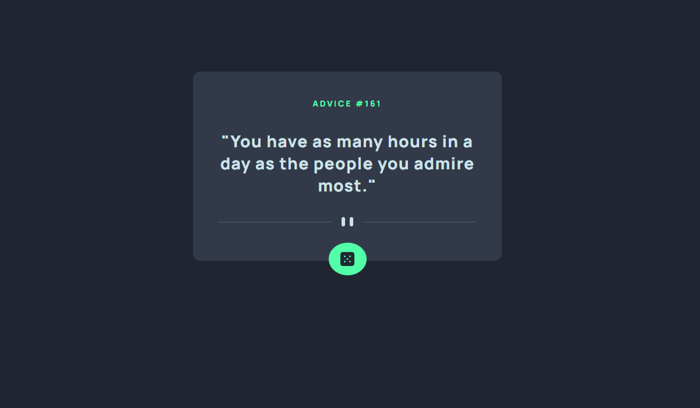

# Advice generator app 
This is my solution for the "Advice generator app" challenge of Frontend Mentor.

What I like about Frontend Mentor is that they give you some details about what they like to see and sometimes some images but that's about it.
You're not given a solution so it's all on you to try and recreate the project as accurately as possible.

This is the first time I've used SCSS/SASS and I must say it's really nice for nesting classes for each specific component.
Makes is so your code is much easier to read! Since I'm studying PHP/SQL atm I really enjoyed doing a JS/React project again.
I hope to combine React with Laravel in the future :)

# My Solution
You can find the Frontend Mentor challenge here:
https://www.frontendmentor.io/challenges/advice-generator-app-QdUG-13db

View my solution at: https://dainty-mandazi-db2546.netlify.app/

